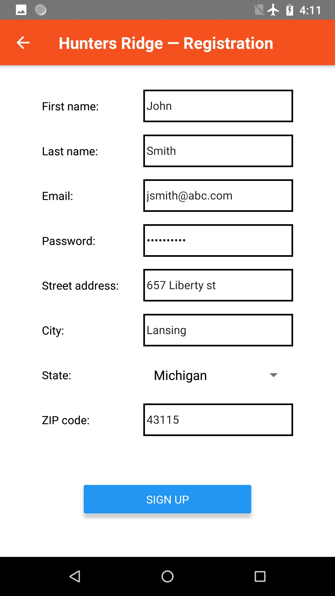

# Special Project in Software: front-end application

## Overview

This is the source code of a mobile application for the "Hunters Ridge Trash Removal" special project.

The application is developed using JavaScript + [React Native framework](https://facebook.github.io/react-native/), so the same source code can be used to create native apps for Android and iOS.

## Application demo

The following screens are implemented so far:

1. Sign in screen (default)

    * Email & password input fields with input validation
    * "Sign In" and "Sign Up" buttons

    
    

2. Registration screen

    * Name, email, password, address (street, city, state, zip), phone fields with input validation
    * "Sign Up" button

    
    

3. Home screen

    * Welcome text
    * Scroll view with service description text
    * "Sign Out" button

    

The application is not connected to the back-end yet. For now, sign in and sign up server requests are mocked and the app simulates server response delay. Hardcoded credentials for sign in:

* email: admin@hr.com
* password: admin

## Development prerequisites

* [NodeJS]( https://nodejs.org/en/download/)
* JDK 8: [OpenJDK](http://openjdk.java.net/) or [Oracle JDK](https://www.oracle.com/technetwork/java/javase/downloads/jdk8-downloads-2133151.html)
* [React Native CLI](https://facebook.github.io/react-native/docs/getting-started)
* For Anrdoid: [Android Studio + Android SDK](https://developer.android.com/studio/index.html)
* For iOS: [Xcode](https://developer.apple.com/xcode/)

See the full guide for setting up React Native development environment [here](https://facebook.github.io/react-native/docs/getting-started)

## Building and running Android app

If you have a physical Android device, plug it in with USB cable and enable "USB Debugging" from the device. See more about running on device [here](https://facebook.github.io/react-native/docs/running-on-device)

Alternatively, you can run on an Android emulator. Create an Android virtual device by opening the "AVD Manager" from within Android Studio. Select the Pie API Level 28 image.

Run the following command from the project folder:
```react-native run-android```
If everything is set up correctly, you should see the app running on your physical or virtual device.

For iOS development see [here](https://facebook.github.io/react-native/docs/running-on-device), select "development OS" macOS and "target OS" iOS.
